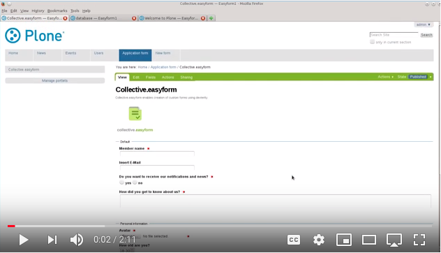

=================================
EasyForm - Form Builder for Plone
=================================

.. image:: https://badge.fury.io/py/collective.easyform.svg
    :target: https://badge.fury.io/py/collective.easyform
    :alt: latest release version badge by Badge Fury

.. image:: https://travis-ci.org/collective/collective.easyform.png?branch=master
    :target: https://travis-ci.org/collective/collective.easyform
    :alt: Travis CI status

.. image:: https://coveralls.io/repos/github/collective/collective.easyform/badge.svg?branch=master
    :target: https://coveralls.io/github/collective/collective.easyform?branch=master
    :alt: Coveralls status

The add on ``collective.easyform`` adds Plone content types for form creation.

EasyForm provides a Plone form builder through-the-web using fields, widgets, actions and validators (based on `Dexterity <https://github.com/plone/plone.dexterity>`_).

Form input can be saved or emailed.
A simple and user-friendly interface allows non-programmers to create custom forms.

Installation
============

Install collective.easyform by adding it to your buildout:

.. code-block:: shell

    [buildout]

    ...

    eggs =
        collective.easyform

Run buildout:

.. code-block:: shell

    bin/buildout

The last step is to activate ``EasyForm`` in the Add-ons control panel.

Usage
=====

- Choose EasyForm from the toolbars 'Add new' menu.
  Insert form title, description and other settings.
- Add fields or fieldsets to create a unique form that will meet your particular requirements.
  There are enough basic field types to satisfy any demands:

  - File Upload
  - Text line (String)
  - Integer
  - Yes/No
  - Date, Date/Time
  - Floating-point number
  - Choice
  - Rich Text
  - Image
  - Multiple Choice
  - Text
  - Password
  - ReСaptcha

- Continue to customize form by setting the order of fields,
  defining required and hidden ones,
  choosing validator, if necessary,
  and other field type specific settings.

Click on the picture below for a short introduction video:

ReCaptcha support
=================

Install ``collective.easyform`` with the  ``recaptcha`` extra:

.. code-block:: shell

    [buildout]

    ...

    eggs =
        collective.easyform [recaptcha]

Run buildout. In the Add-ons control panel, activate both EasyForm and the ReCaptcha widget.

In the ReCaptcha control panel, set the public key and private key values you obtained from https://developers.google.com/recaptcha/ (you can use reCAPTCHA V2).

In the EasyFrom control panel (``/@@easyform-controlpanel``), add the "ReCaptcha" field to "Allowed Fields".
Alternatively, activate it by adding it as an ``registry.xml`` entry for Generic Setup:

.. code-block:: xml

    <record name="easyform.allowedFields">
      <value purge="False">
        <element>collective.easyform.fields.ReCaptcha</element>
      </value>
    </record>

Add the ReCaptcha field to the forms where you want to use it.
Use the field type ``ReCaptcha`` and leave ``require`` unchecked.

As a last step you might want to avoid including the recaptcha field in the thank you page and in the mailer action.
To do that, edit the form, go to the "Thanks page" settings, disable "Show all fields" and then include only those you want.
Likewise for the mailer: open the form actions via the Actions toolbar menu and edit the mailer settings accordingly.

collective.z3cform.norobots support
===================================

Install ``collective.easyform`` with the  ``norobots`` extra:

.. code-block:: shell

    [buildout]

    ...

    eggs =
        collective.easyform [norobots]

Run buildout. In the Add-ons control panel, install EasyForm.

In the EasyFrom control panel (``/@@easyform-controlpanel``), add the "NorobotCaptcha" field to "Allowed Fields".
Alternatively, activate it by adding it as an ``registry.xml`` entry for Generic Setup:

.. code-block:: xml

    <record name="easyform.allowedFields">
      <value purge="False">
        <element>collective.easyform.fields.NorobotCaptcha</element>
      </value>
    </record>

Add the NorobotCaptcha field to the forms where you want to use it.
Use the field type ``NorobotCaptcha`` and leave ``require`` unchecked.

As a last step you might want to avoid including the norobotcaptcha field in the thanks page and the mailer action.
To do that, edit the form, go to the "Thanks page" settings, disable "Show all fields" and then include only those you want.
Likewise for the mailer: open the form actions via the Actions toolbar menu and edit the mailer settings accordingly.

Actions
=======

You can choose between the following actions after form submission:

* Mailer
* DataStorage
* CustomScript

The mailer stores a HTML template for sending the results of the form. You can override it with a file named
`easyform_mail_body_default.pt` in your site. If it is not found the default from the `default_schemata` directory
of this package is taken. If you plan to override start with the the `mail_body_default.pt` file and make sure
it is a valid pagetemplate.

Related Addons
==============

**Note:** This Plone package is similar to `Archetypes <http://docs.plone.org/develop/plone/content/archetypes/>`_ based `Products.PloneFormGen <https://github.com/smcmahon/Products.PloneFormGen>`_ for Plone versions 1 to 4. Now, Dexterity is the default framework for building content types in Plone 5. ``collective.easyform`` is based on Dexterity.

Source Code and Contributions
=============================

If you want to help with the development (improvement, update, bug-fixing, ...) of ``collective.easyform`` this is a great idea!

- `Source code at Github <https://github.com/collective/collective.easyform>`_
- `Issue tracker at Github <https://github.com/collective/collective.easyform/issues>`_

You can clone it or `get access to the github-collective <https://github.com/collective>`_ and work directly on the project.

Please do larger changes on a branch and submit a Pull Request.

Maintainer of ``collective.easyform`` is the Plone Collective community.

We appreciate any contribution !

For new release, please contact one of the owners or maintainers mentioned at the `Python Package Index page <https://pypi.python.org/pypi/collective.easyform>`_.

Contribute
==========

- Issue Tracker: https://github.com/collective/collective.easyform/issues
- Source Code: https://github.com/collective/collective.easyform

License
=======

The project is licensed under the GPLv2.

Compatibility
=============

- 1.x targets Plone 4.x
- 2.x targets Plone 5.x onwards

