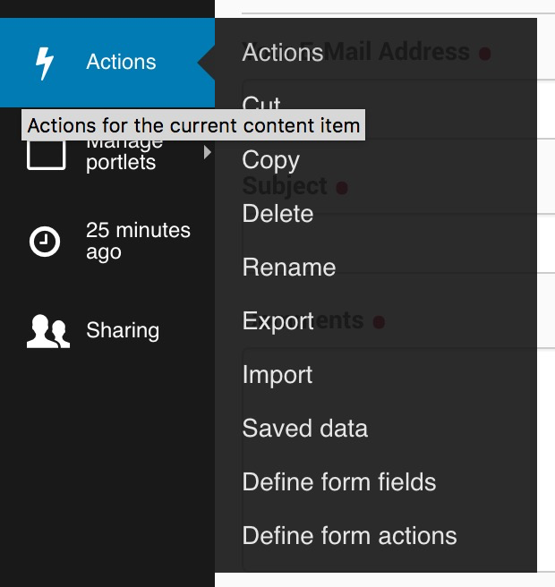
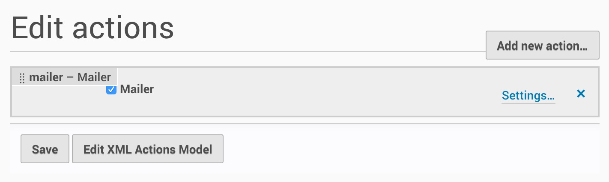
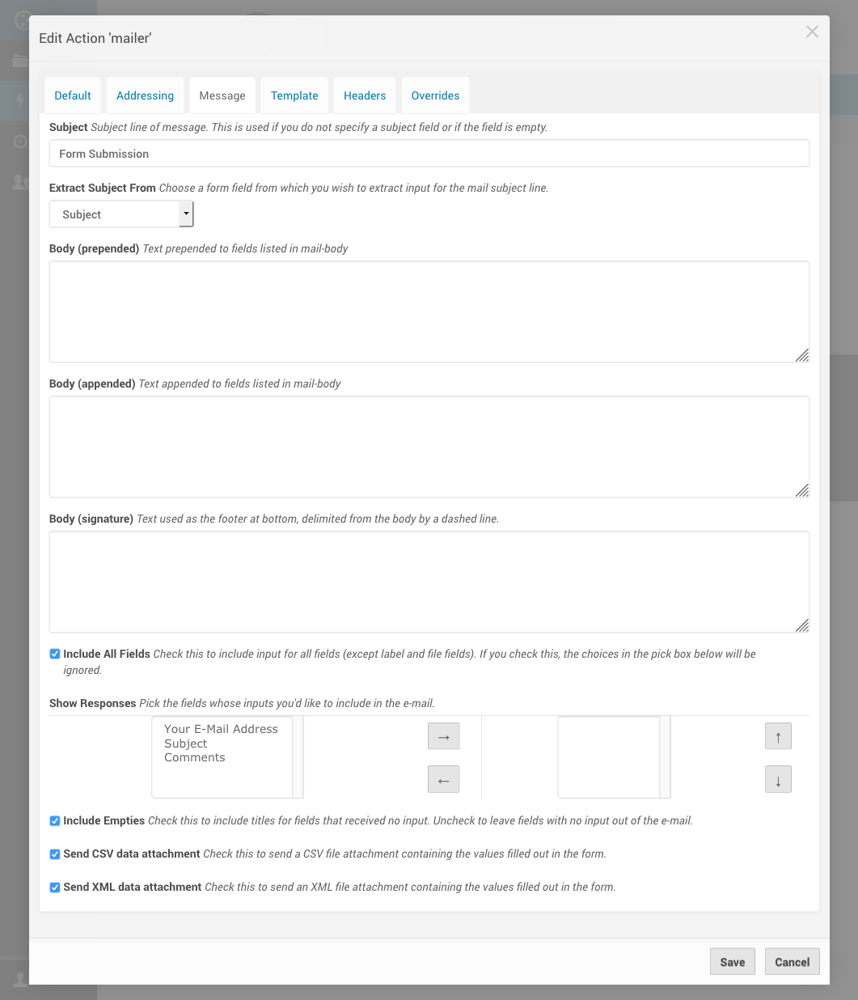

Actions
=======

Adding new action
-----------------

.. image:: images/click-actions-contentview.png

.. image:: images/created-easyform-actions.png

.. image:: images/click-add-new-action.png

.. image:: images/add-new-action-overlay.png

.. image:: images/added-new-action.png

Edit action
-----------

.. image:: images/created-easyform-actions.png

Edit XML Actions Model
----------------------

.. image:: images/edit-xml-actions-model-button.png

.. image:: images/edit-xml-actions-model-page.png

Save data adapter
-----------------

The Save Data adapter saves data submitted to a form. You can export the saved data as a comma-separated values (CSV)
or a tab-separated values (TSV) file. You can view the saved data and edit it.

If you need programmatic access to the saved data, e.g. to display the number of saved data rows for a given form,
use the `@@get_save_data_adapters` view. The following `count_items` page template displays the number of saved data
rows for all save data adapters for a given form by calling the `@@get_save_data_adapters` view then, for each
save data adapter it returns, outputting its ID and the number of rows it contains.

::

    <html>
      <head>
        <title tal:content="template/title">The title</title>
        <meta http-equiv="content-type" content="text/html;charset=utf-8">
      </head>
      <body>

        The form with ID [form id] contains the following save data adapters:

        <ul>
            

                <li>
                    ID: [item count] items
                </li>

            

        </ul>

      </body>
    </html>

This is what `count_items` outputs:

::

    The form with ID ff1 contains the following save data adapters:
    <ul>
    

    <li>
    save_data: 6 items
    </li>
    

    

    <li>
    save_data_2: 2 items
    </li>
    

    </ul>

Mailer Adapter
--------------

When you create an EasyForm, it includes a mailer adapter action that is activated by default.

You can view an EasyForm's actions by clicking on the Actions toolbar menu, choosing "Define form actions".

You can view and change the settings of that mailer by clicking on its "Settings..." link.

In the mailer's settings, the "Message" tab contains checkboxes that let you send submitted data as a CSV or XML file attachment.

