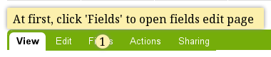
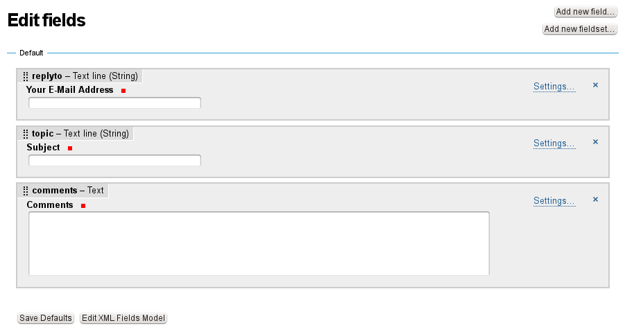
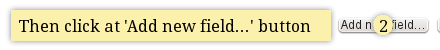
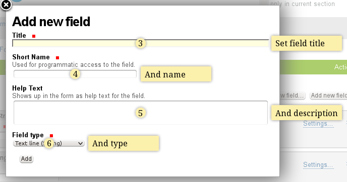
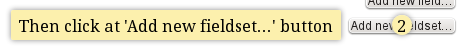
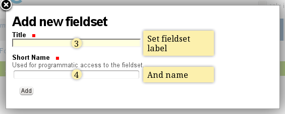
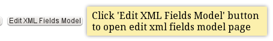
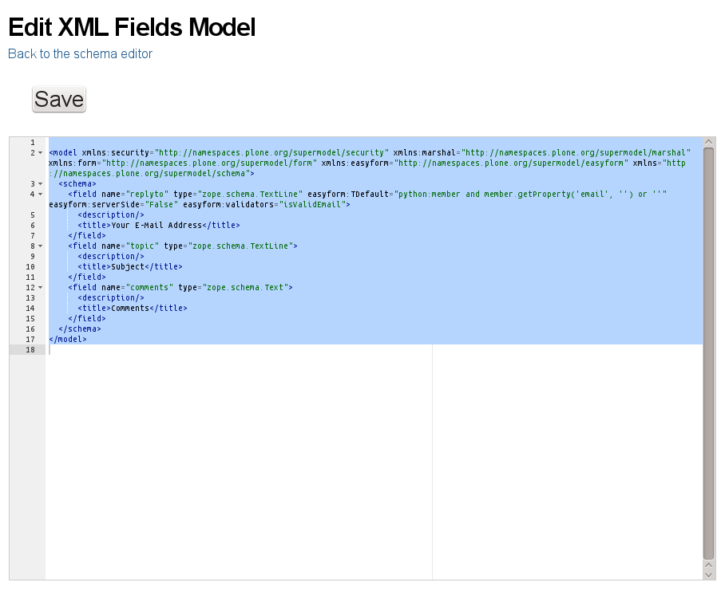

Fields
======

Adding new field
----------------

.. image:: images/added-new-field.png

Adding new fieldset
-------------------

.. image:: images/added-new-fieldset.png

Edit field
----------

Edit XML Fields Model
---------------------

Validating file uploads
-----------------------

Collective.easyform comes with a custom validation view,
which helps with validation of file uploads. It supports
two modes:

 * file size validation
 * file type validation

For file type validation a blacklist or whitelist can be used.

For validation of filesize put the following line into
the custom validator of a file upload field:

 `python:portal.restrictedTraverse('validate_file')(value, size=300)`

where `size` is the maximum allowed size in bytes.

Validation against the filetype is done by checking the file extension.
Use this for whitelisting:

 `python:portal.restrictedTraverse('validate_file')(value, allowed_types=('pdf', 'docx'))`

and this for blacklisting:

 `python:portal.restrictedTraverse('validate_file')(value, forbidden_types=('zip', 'rar'))`

Make sure the types in `allowed_types` or `forbidden_types` are all lowercase.
